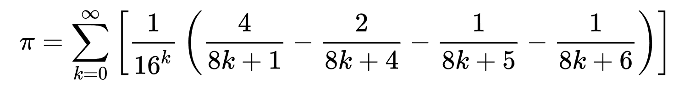
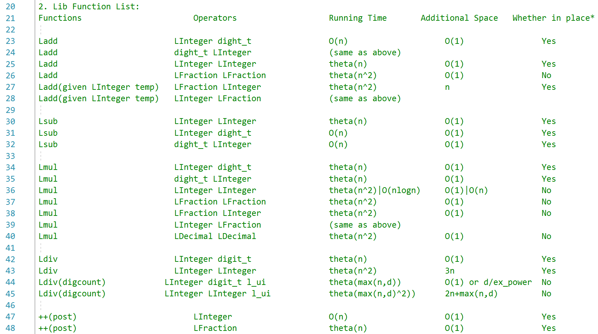
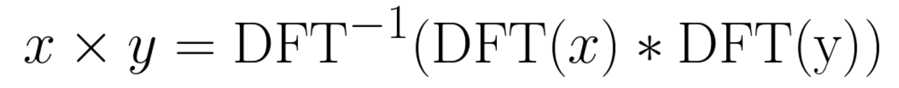

# ApproxPi
(This is an archive repository for a project developed in 2011)

AppoxPi is a large number C++ library built for the approximations of π. It computes π in an arbitrary given radix (base) and to an arbitrary given precision with the Bailey–Borwein–Plouffe (BBP) formula:

For example, this is what π looks like in radix 24 when mapped to RGB values:

To allow the computation of large numbers in arbitrary radix, this project builds a large number arithmetic library in C++:

The dominant computation cost is the multiplications of the large numbers. For fast computation, this project uses an FFT-based (fast Fourier transform) algorithm, which reduces the quadratic complexity to <i>O</i>(<i>n</i>log<i>n</i>):

`ArbitraryRadix/ARmain.cpp` is the main file for the computation of π, and `lib/LargeNumbers.h` is the entry file for the large number library. 

Note that the Visual Studio solution file has been updated from VS2010 to VS2017 during the release.
